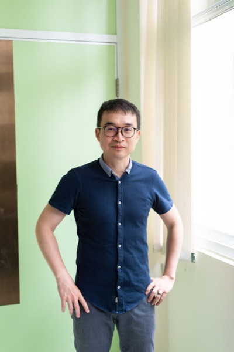

Associate professor since 2022/02
Department of Computer Science, National Chengchi University
Taipei, Taiwan

[GoogleScholar](http://scholar.google.com/citations?user=5TgmGNEAAAAJ&hl=en) ·
[ResearchGate](https://www.researchgate.net/profile/Jia-Ming_Chang4)

於清華大學資工系修讀學士與碩士學位，2002年清大畢業後，在中研院資訊所服國防役，2008
到西班牙巴塞隆納基因調控研究中心 (Centre for Genomic Regulation) 修讀博士學位，2013年到
法國蒙彼利埃人類基因體研究中心 (Institute of Human Genetics) 從事博士後研究，2016年開始到
政大資科系服務至今，曾獲4年La Caixa博士獎學金、政大理學院年輕學者研究、政大學術研究優良、
科技部優秀年輕學者研究計畫。

I earned my Bachelor's and Master's degrees in the Dep. of Computer Science at National
Tsing Hua University. After graduating from NTHU in 2002, I completed my military service
at the Institute of Information Science, Academia Sinica. In 2008, I pursued my Ph.D. at
the Centre for Genomic Regulation in Barcelona, Spain, and in 2013, I conducted
postdoctoral research at the Institute of Human Genetics in Montpellier, France. Since
2016, I have been serving in the Dep. of Computer Science at National Chengchi University.
I have received a few awards and recognitions, including a 4-year La Caixa Ph.D.
scholarship, the NCCU College of Science - Young Scholarship Award, the NCCU Academic
Research Awards, and an Excellent Young Scholar Research Grants from the Ministry of
Science and Technology.

## Educations

- **10/2008-07/2013** PhD. Centre for Genomic Regulation and Universitat Pompeu Fabra, Spain
  Influence of alignment uncertainty on homology and phylogenetic modeling
  Supervisor: Dr. Cedric Notredame
- **09/2000-06/2002** M.S. Dep. of Computer Science, National Tsing Hua University, Taiwan
  Compact Set Relation and Its Application in the Evaluation of the Evolutionary Tree and Multiple Sequence Alignment
  Supervisor: Dr. Chuan Yi Tang
- **09/1996-06/2000** B.S. Dep. of Computer Science, National Tsing Hua University, Taiwan
  *Admitted through the first cohort of special admission quotas for recommended students（第一屆推薦甄試入學）*

## Experience

- **02/2016-02/2022** Assistant Professor — Dep. of Computer Science, National Chengchi university
- **01/2014-02/2016** Postdoc — [Institute of Human Genetics](https://www.igh.cnrs.fr/en) (IGH), CNRS, France, Dr. [Giacomo Cavalli](https://www.igh.cnrs.fr/en/research/departments/genome-dynamics/chromatin-and-cell-biology)'s Lab
- **07/2013-12/2013** Postdoc — [Centre for Genomic Regulation](https://www.crg.eu/) (CRG) and Universitat Pompeu Fabra (UPF), Spain, Dr. [Cedric Notredame](https://mbzuai.ac.ae/study/faculty/cedric-notredame/)'s Lab
- **02/2013-03/2013** Intern Student — Biodiversity Research Center, Academia Sinica, Taiwan, Dr. Wen-Hsiung Li's Lab
- **05/2011-07/2011** Intern Student — Comparative Genomics, European Bioinformatics Institute, UK, Dr. Javier Herrero
- **10/2002-08/2008** Research Assistant — Institute of Information Science, Academia Sinica, Dr. Wen-Lian Hsu and Dr. Ting-Yi Sung

## Honors & Awards

- 108年 政大學術研究優良 NCCU Academic Research Awards
- 108年 政大理學院年輕學者研究獎勵 NCCU College of Science - Young Scholarship Award, 2019 Academic Year
- 107/108/111/112年 國科會補助大專校院研究獎勵
- 105/106年 科技部延攬特殊優秀人才
- 06/2012, travel award, the Society for Molecular Biology & Evolution (SMBE) Dublin
- 10/2008, fellowship, "la Caixa" International PhD Programme 4-year fellowships

## Services

### Editorial

- **Deputy Editor**, [NAR Genomics and Bioinformatics](https://academic.oup.com/nargab/pages/Editorial_Board) (2024-11~)
- **Associate Editor**, [NAR Genomics and Bioinformatics](https://academic.oup.com/nargab) (2024-01–2024-10) — 2024-11 起改任 Deputy Editor

### Academic administration

- **Chief Executive Officer**, [Executive Master Program of Computer Science, 國立政治大學](https://ah.lib.nccu.edu.tw/scholar?id=7305&title=person) (2023-08-01–2024-07-31)
- **Director of Program**, [人工智慧應用學士學位學程, 國立政治大學](https://ah.lib.nccu.edu.tw/scholar?id=7305&title=person) (2022-08-01–2027-07-31)

### Program committee

- **Program Committee**, [InCoB/ISCB-APAC 2026](https://incob.apbionet.org/incob2026/committee/) (2026)
- **Program Committee**, [InCoB 2025](https://incob.apbionet.org/incob2025/committee/) (2025)
- **Program Committee**, [InCoB 2023](https://incob.apbionet.org/incob23/committee/) (2023)
- **Program Committee**, [InSyB 2023](https://insyb.apbionet.org/insyb23/committee/) (2023)

### Professional societies

- **理事（第三、四屆）**, 演算法與計算理論學會
- **理事（第四屆）**, 台灣演化與計算生物學會
- **理事（第四、五屆）**, 清華大學資訊工程學系系友會

## Extracurricular Activities

| 日期 | 距離 | 成績 | 賽事 |
|---|---|---|---|
| 2012/09/16 | 10km | 57:54 | Cursa de la Mercè |
| 2011/10/09 | 04km | 20:14 | Cursa Vencer el Cancer |
| 2011/07/09 | 10km | 56:28 | London 10km |
| 2010/12/31 | 10km | 51:09 | Cursa dels Nassos-Gran Premi Ibercaja |
| 2010/04/18 | 10km | 49:50 | Cursa Bombers |
| 2009/04/05 | 10km | 53:17 | Cursa Bombers |
| 2007/06/28 | 5.2km | 3h:26m | Balaton-crossing swimming competitions, Revfulop Hungary |
| 2006/11/04 | 21.5km | 2:27:56 | Half Marathon, Taroko Internaltional Marathon, Hualien, Taiwan |
